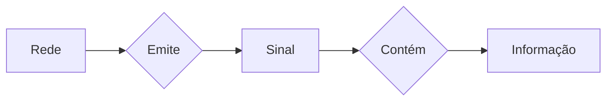

# Redes

#### Transmissão da informação

#### Protocolo

*`Uma série de regras e procedimentos definidos para que uma comunicação possa acontecer de forma eficaz.`*

# 1 - Emissor / Receptor

### 1.1 - DTE ( _Data Terminal Equipment_ )

Responsável por **gerar** a informação que será transmitida. Em resumo, são os dispositivos que geram, recebem ou armazenam dados, como computadores, terminais e impressoras e interagem diretamente com o usuário ou com o sistema que utiliza os dados.

### 1.2 - DCE ( _Data Communication Equipment_ )

Responsável pela **codificação** da informação a ser transmitida no formato mais adequado para transmissão. Fornecem a interface entre o DTE e a rede de comunicação sendo então os dispositivos que facilitam a comunicação entre DTEs, como modems, roteadores e conversores de protocolo. 

# 2 -  Meio fisico

É o material ou substrato responsável pelo suporte ao encaminhamento dos sinais. Estes, por sua vez, encontram-se, tal como já vimos, codificados com a informação a ser transmitida. 
O meio físico mais adequado para a transmissão dos sinais é determinado por:
* Características do ambiente por onde o sinal será encaminhado;
* Custo associado à sua disponibilidade;
* Velocidade;
* Taxa de transferência necessárias;
* Distância entre emissor e receptor.

## 2.1 - Propriedades
### 2.1.1 - Velocidade de propagação

É medida em metros por segundo (_m/s_), e representa a velocidade com que o sinal que carrega as informações se propaga pelo meio físico em questão.
A velocidade de propagação é definida como a razão entre o espaço percorrido por um determinado sinal em um meio físico $\Delta S$, e o tempo decorrido para percorrê-lo $\Delta T$.

$$
	Vp = \frac{\Delta S}{\Delta T}
$$

### 2.1.2 - Taxa de sinalização ( _baud rate_ )

Podendo ser medida em bouds ou Hz, a taxa de sinalização é a **frequência máxima** com que um sinal em um meio físico pode mudar de estado por segundo, representando então um limite para que a informação seja transmitida sem perdas significativas. Essas "_alterações de estado_," também chadas de "_eventos_", podem ser:

*   **Variações de voltagem:** Em um cabo elétrico, o estado pode mudar de uma voltagem alta para uma baixa.
*   **Variações de luz:** Em uma fibra óptica, o estado pode ser a presença ou ausência de luz.
*  **Variações de fase:** Em sinais sem fio, a fase da onda pode mudar.

Definindo então a velocidade com que os "_eventos_" do sinal ocorrem, ela é uma medida fundamental que está diretamente relacionada à capacidade de um meio físico de transmitir informações sem que o sinal se degrade, sendo um fator limitante na velocidade de transmissão de dados.

Fazendo uma analogia, a taxa de sinalização poderia representar o limite que um cano pode transportar um liquido sem que ele estoure, fazendo os relacionamentos ficaria:

- Vazão do liquido ----> Taxa de sinalização
- Cano -----------------> Meio físico (cabos por exemplo)
- Liquido---------------> Informação
- Pressão do liquido --> Evento
- Estourar do cano ----> Degradação da informação

### 2.1.3 - Taxa de transferência ( _bit rate_ )

É dada pela quantidade de informação (_bit_) que é codificado, enviado e decodificado - ou seja, que é transferida - em segundo (_bps_). Ela não está relacionada apenas ao meio físico, mas também à taxa de sinalização e à tecnologia de codificação utilizada.
A taxa de transferência e a taxa de sinalização estão inter-relacionadas, então, pela tecnologia de codificação utilizada.

$$
	T_{tr} = T_{s} . \log_{2}(n)
$$

- $T_{tr}$ = Taxa de transferendia (bps)
- $T_{s}$ = Taxa de sinalização (Hz)
- $n$ = Representa a quantidade de **estados diferentes** que cada uma das alterações de estado da $T_{s}$ pode assumir. Em outras palavras, é o "número de opções" de estados que o sinal pode ter a cada evento. Quanto maior $n$ for, maior a BER (*Bit Error Rate*).

$$
	BER = \frac{Bits_{recebidos-com-erro}}{Bits_{transmitidos}} 
$$

## 2.2 - Classificação

### 2.2.1 LAN

São definidas como redes de comunicação de alcance limitado, normalmente utilizando meios físicos de propriedade privada da organização atendida pela rede. Como os meios físicos são de uso dedicado, normalmente estes são dimensionados para oferecer a melhor performance possível dentro das limitações de distância da organização. Por isto as LANs normalmente oferecem taxas de sinalização e velocidades de propagação bastante elevadas. Como é bem mais fácil evitar fontes de interferência e ruído dentro de distâncias limitadas, as taxas de erro típicas (BER) são reduzidas. Conseqüentemente, as taxas de transferência típicas são elevadas, atendendo a um conjunto bastante grande de aplicações.

### 2.2.2 WAN

Ao contrário das LANs, as WANs não possuem limites de distância. Normalmente são atendidas por meios físicos ofertados por concessionárias de serviços de telecomunicações, e por isto têm a capacidade total de seus meios físicos rateados entre os diversos usuários. As WANs normalmente possuem performance limitada, e taxas de erro elevadas. Isto limita as aplicações que podem ser utilizadas em ambientes baseados neste tipo de infra-estrutura de telecomunicação.

### 2.2.3 MAN

Possui um misto de características entre as LANs e as WANs. Normalmente espalhadas dentro dos limites de uma cidade (raio típico de até 70km), as MANs oferecem performance normalmente superior às WANs, e com isto permitem aplicações mais especializadas.

de quem é o cabo? seu? LAN; do outro? WAN
LAN - quando não há limites em problemas técnicos (performace, taxa de erro, atraso, etc)
WAN - area estendida pelo globo / grandes distâncias
MAN - Região metropolitana

#### Por Tanenbaum:

- LANs: Rede de área Local (até 2km)
- WANs: Rede de área estendida (de 2km até a estratosfera)
- MANs: Redes de Área Metropolitana

#### Por Marco Câmara:

- LAN: se você é dono do cabo
- WAN: se a operadora é dona do cabo
- MAN: rede bancada pelo governo

##  2.3 Tipos de meios físicos

# 3 Tipo processamento

### 3.1 Lote

**Método no qual grandes volumes de dados coletados são processados em partes ou lotes**. Essa abordagem é especialmente eficaz para trabalhos com uso intensivo de recursos, tarefas repetitivas e gerenciamento de conjuntos de dados extensos em que o processamento em tempo real não é necessário.
Neste tipo de processamento, cada informação a ser processada é arquivada temporariamente até a formação de um grupo (conhecido como lote ou batch), para posterior processamento.

### 3.2 Online

Refere-se principalmente a ferramentas e software que executam tarefas de gerenciamento e monitoramento de redes pela internet, como a criação de diagramas de topologia, análise de tráfego e detecção de falhas, utilizando tecnologias baseadas na web para maior acessibilidade e colaboração em tempo real.
Indica o encaminhamento imediato das informações para o processamento, sem nenhum agrupamento anterior. Isto exige a conexão contínua entre o emissor e o receptor do sistema de telecomunicações.

### 3.3 Tempo Real

O processamento de rede em tempo real  envolve a coleta e análise contínua e imediata de dados de rede para identificar problemas, monitorar a utilização e garantir a performance de serviços críticos como videoconferência, permitindo a tomada de decisões e ações corretivas instantâneas para manter a qualidade e a estabilidade da rede.
Na prática, o tempo de resposta deve ser suficientemente pequeno para garantir a influência no processo subseqüente. Sendo assim, a depender da aplicação, podemos ter diferentes tempos de resposta, sem perder a característica de processamento em tempo real.

- Precisa ser on-line

# 4 Classificação das transmissões

## 4.1 Quanto ao sentido do fluxo

Em um sistema de telecomunicações, as informações podem fluir em diversos sentidos, a depender da aplicação e da tecnologia empregada. Para caracterizar e identificar os sentidos dos fluxos de informação em um sistema de telecomunicações, utiliza-se as seguintes nomenclaturas:

### 4.1.1 __Simplex__

- Mensagem apenas de A -> B, um unico sentido

### 4.1.2 __Half-Duplex__

- Tempo e/ou sentido diferente
- Mensagem vai no sentido A <-> B
- Ex: Walkie Talkie

### 4.1.3 __Full-Duplex__

- Tempo e/ou sentido igual
- Mensagem vai so sentido A <-> B
- Ex: Ligação por telefone

## 4.2 Quanto ao formato

Ao encaminhar as informações, pode-se escolher entre o envio serial ou paralelo dos dados. Em uma transmissão, os dados são codificados em conjuntos de bits, ou palavras (tipicamente iguais a um byte). 

Na **transmissão paralela**, são transmitidos todos os bits de uma palavra ao mesmo tempo, por meios físicos individuais. Apesar de rápida, a transmissão paralela tem problemas, como o custo mais elevado para distâncias mais elevadas, devido à necessidade de meios físicos mais complexos e caros, além da maior sensibilidade a interferências externas, também devido à exposição de um maior número de meios físicos.

Na **transmissão serial**, os bits são transmitidos de um a um, em série (daí o nome). Apesar de mais lenta, é largamente utilizada devido à sua padronização e baixo custo. Ainda falando da transmissão serial, esta pode ocorrer de duas formas:

### 4.2.1 __Síncrona__

O sincronismo não precisa ser reestabelecido tantas vezes. Os dados são enviados em um fluxo contínuo

Neste tipo de transmissão, os DCEs do emissor e do receptor se sincronizam para a transmissão de um conjunto de dados, normalmente bem maior do que os caracteres transmitidos na transmissão assíncrona. O processo de estabelecimento do sincronismo (durante o qual não ocorre transmissão de dados) ocorre apenas no início de cada bloco, o que implica em um desperdício da capacidade de transmissão do canal bem menor do que nas transmissões assíncronas. Esta maior eficácia de transmissão exige, tipicamente, a utilização de técnicas mais apuradas para detecção de erros.
Além disto, como a verificação dos erros só pode ser realizada ao final da transmissão de cada bloco, os DCEs do emissor e do receptor devem ser capazes de armazenar o conjunto de bytes a ser transmitido ou recebido em um buffer.

### 4.2.2 __Assíncrona__

O sincronismo precisa ser reestabelecido muitas vezes. Ex: envio de um byte por vez. Os dados são enviados em blocos separados, com intervalos entre eles, e cada bloco geralmente inclui bits de início e parada para indicar o começo e o fim.
Caracteriza-se pela necessidade de sincronização ao final da transmissão de cada palavra. Em função disto, são acrescentadas informações no início e final de byte, para identificação e sincronismo. O termo assíncrona, embora possa nos levar a acreditar que trata-se de uma transmissão sem sincronismo, na verdade deve ser interpretada como um sincronismo simplificado, e não muito preciso. O mesmo termo também é utilizado, em algumas situações, para identificar o fato do DCE do receptor nunca saber quando será recebido o próximo byte (ou caractere), já que a transmissão pode ser iniciada e interrompida a qualquer momento. Isto advém da transmissão ocorrer de forma dividida em pequenas unidades.

# 5 Codificação de dados

## 5.1 Modulação

Quando falamos em **modulação**, estamos falando de **pegar um sinal puro (uma senoide)** e **alterar alguma característica dela** (amplitude, frequência ou fase) para transportar informações.

### 5.1.1 Por que senoide?  

Porque a senoide é o **comportamento natural das ondas** (som, luz, rádio, etc). Ela é uma forma de onda básica que se repete infinitamente e é fácil de manipular matematicamente.

Exemplo:

-   Modulação em **amplitude (AM)** → altera a altura da onda.
-   Modulação em **frequência (FM)** → altera a quantidade de oscilações por segundo.
-   Modulação em **fase (PM)** → altera a posição da onda no tempo.

## 5.2 Senoides

### 5.2.1 Amplitude

É a "altura" da onda → a distância entre o topo (pico) e o fundo (vale).

-   Maior amplitude = sinal mais forte (mais energia).
    
###  5.2.2 Frequência e Período

-   **Frequência (f)** = quantas vezes a onda se repete por segundo (Hz).
-   **Período (T)** = tempo que a onda leva para completar **1 ciclo**.
    -   Fórmula: $f = \frac{1}{T}$
-   **Comprimento de onda (λ)** = quanto a onda "anda" no espaço durante um ciclo.
    -   Fórmula: $\lambda = \frac{v}{f}$​ (velocidade / frequência).
        
###  5.2.3 Fase

É a **posição da onda em relação ao eixo x (tempo)**.

-   Imagina duas ondas iguais, mas uma começa "atrasada" → isso é diferença de fase.
-   Medida em radianos: $\pi$
	- 0º -> $\frac{\pi}{2}$ -> $\pi$ -> $\frac{3\pi}{2}$ -> $2\pi$ ou 0º
-   Representada no círculo trigonométrico.

###  5.2.4 Banda-base

Na **banda-base**, o sinal não passa por uma senoide modulada, os **bits são enviados diretamente como pulsos de tensão** no meio físico.

#### 5.2.4.1 NRZ (Non Return to Zero)

Assincrona, precisa ser enviado o clock
- unipolar ($0V$ -> $+V$) 
- bipolar ($-V$ -> $+V$) / 0 = -1 e 1 = +1

#### 5.2.4.2 RZ (Return to Zero)

Assincrona, precisa ser enviado o clock
Cada bit tem um pico único

- unipolar ($0V$ -> $+V$) 
- bipolar ($-V$ -> $+V$) / 0 = -1 e 1 = +1

#### 5.2.4.3 Manchester

Sincrona, não precisa enviar o clock
Nao mede o valor de cima e o de baixo, mede se subiu ou se desceu.
Analiza o meio do ciclo

$0$ -> sobe
$1$ -> desce

## 5.3 Análise de Sinais

###  5.3.1 Jean-Baptiste Joseph Fourier (1768 - 1830)

Ele mostrou que **qualquer sinal, por mais estranho que pareça, pode ser representado como a soma de várias senoides** de diferentes frequências, amplitudes e fases.

#### Transformada de Fourier

$$
	f(t) = \frac{1}{\pi} \int_0^{\infty} (A(w) cos(w) + B(w)sen(w)) dw
$$

Isso é a **Transformada de Fourier** → pega um sinal no tempo e decompõe em suas frequências.

#### Exemplo clássico: onda quadrada

Uma onda quadrada não é "natural", mas Fourier mostrou que ela pode ser formada somando infinitas senoides:

$$
	f(t) = \frac{a}{2} + \sum_{n = 1}^{\infty} \frac{1}{n} sen(n x)
$$

-   A primeira senoide (n=1) é a **fundamental**.
-   As outras (n=3,5,7...) são as **harmônicas**.
-   Quanto mais harmônicas você soma, mais a onda fica parecida com um quadrado.

#### O que significa "infinitas senoides"?

Significa que **qualquer forma de onda (mesmo quadrada, triangular ou um som de música)** pode ser decomposta em uma soma de senoides de frequências diferentes.

-   Uma senoide pura = som "limpo".
-   Um sinal quadrado = infinita soma de senoides harmônicas.

# 6 Unidades de medida

A potência de um sinal é uma característica fundamental para a análise de um sistema de telecomunicações, já que o sinal que chega ao receptor deve ter uma potência mínima para que possa ser interpretado.
Medem as alterações ocorridas na potência de um sinal ao atravessar um sub-sistema qualquer, seja um meio físico ou equipamento de comunicação.

## 6.1 Decibel ($dB$)

O Decibel é a relação logarítmica entre as potências de saída e de entrada e como estamos dividindo uma potência pela outra, trata-se de uma unidade adimensional (sem dimensão).

> Uma unidade adimensional  não possui unidades de medida e pode ser entendida como um número puro ou um valor que não está ligado a uma dimensão física como massa, tempo ou comprimento. Elas geralmente surgem da divisão de duas grandezas de mesma unidade, resultando na anulação das unidades e, consequentemente, um valor sem dimensão.

No entanto, devido aos típicos valores fracionários desta unidade, na prática é mais utilizada a sub-unidade decibel (dB), que igual a valor em Bells (resultado do logaritmo decimal da divisão $\frac{P_e}{P_s}$ ) multiplicado por 10. E assim obtemos a formula:

$$
	Ganho/Atenuação = 10 \log{ \frac{ P_e }{ P_s }} 
$$

> Lembre-se, a potência é medida em Watts $W$

E se for:
- $> 1$ -> Amplificação
- $= 1$ -> Resposta plana (Quase nunca)
- $> 1$ -> Atenuação (Na maioria das vezes nas redes)

## 6.2 Relação de potências ($dBm$)

Para simplificar os cálculos de relação de potência, usando as propriedades dos logaritmos, é adotado pelos profissionais de telecomunicações uma nova unidade de potência absoluta, o $dBm$. Os valores de potência em $dBm$ são obtidos através da comparação das potências expressas em Watts com uma potência de referência de $1mW$.

$$
	P[dBm] = 10 \log { \frac{ P[W] }{ 1mW } }
$$

Para obter ganho ou atenuação em $dB$ a uma potência expressa em $dBm$, basta somar os dois valores no caso de ganhos, ou subtrair em caso de atenuação.

**Perda/Ganho (em dB)** = $P_{saída}$​[dBm] − $P_{entrada​}$[dBm]

Observações: 
-	Não se deve somar comparações, $dBm$ para obter $dBm$. Para soma-los de fato, você precisa primeiro converter os valores de $dBm$ de volta para a escala linear de potência em miliwatts (mW), somá-los, e depois converter o resultado de volta para dBm.
- $dBm$ pode ser negativo sem problema, mesma lógica de aceleração negativa (Freio), significa que a potência medida é **menor que 1 mW**
- $W$ nunca deve ser negativo, mesma lógica de distancia/tempo negativo (-50m? -10s?)

# 7 Definição de rede

 - Computadores autônomos: Só se conecta a rede o dispositivo que tem capacidade própria de processamento;
- Interligação: Ligação entre os dispositivos que permite a troca de informação entre eles.

## 7.1 Estrutura das redes

Para cada um dos dispositivos interligados ao ambiente de rede, vamos dar o nome de host (hospedeiro). O ambiente de comunicação envolvido na interligação dos hosts será chamado de sub-rede e para que seja mais simples a análise de sub-redes mais complexas, temos mais dois elementos básicos: os circuitos ou canais de comunicação e os elementos comutadores. Chamaremos estes elementos comutadores de IMP (_Interface Message Processors_) e eles são pontos onde os hosts se conectam a sub-rede.

## 7.2 Tipos de subredes

### 7.2.1 Difusão (Broadcasting)

Neste tipo de sub-rede, existe apenas um canal de comunicação, que é compartilhado por todas as estações. Desta forma, um pacote enviado por uma estação é recebido por todas as outras e ao receber um pacote, a estação deve ser capaz de analisar o endereço de destino para verificar se o pacote pertence a ela, fazendo com que o endereçamento seja um ponto essencial para um funcionamento de uma sub-rede por difusão. São muito comuns em LANs

- Vantagens:
	- Os dados são enviados em toda a area do dispositivo e todos os dispositivos podem ver;
	- Otimos para mandar mensagens.
- Desvantagens
	- Tempestade de broadcast: Quando há muitas mensagens no meio, muitas mensagens sendo transmitidas ao mesmo tempo na area

### 7.2.2 Ponto a ponto

Uma sub-rede ponto a ponto é uma conexão de rede a mais simples possível, ligando diretamente apenas dois dispositivos, como dois roteadores ou computadores. Por conectar somente dois pontos, ela permite uma comunicação extremamente direta e eficiente, sem a necessidade de intermediários. Este é o tipo de projeto normalmente adotado nas redes de longa distância (WAN).

## 7.3 Topologias fisicas

Como são as interligações entre os IMPs (dispositivos) há sub-rede e descrevem o modo como os dispositivos estão interligados, bem como é feita a troca de informação entre eles. Esta pode garantir não só a performance do ambiente, como também a segurança e os custos envolvidos na implementação do projeto. 

### 7.3.1 Estrela

Considera a interligação de todos os pontos a um equipamento central, que pode ser composto por um dos hosts ou por um equipamento especial, conhecido como concentrador (ou HUB). O aumento do número de dispositivos na topologia em estrela é normalmente ilimitado, o que torna fácil a expansão da rede.

Em alguns casos, adota-se uma topologia derivada, chamada de topologia em árvore ou estrelas hierárquicas. Nesta, todas ou algumas extremidades da estrela se transformam no centro de novas estrelas secundárias. Neste caso, temos 3 níveis: o ponto central, os pontos secundários, e os hosts. Sendo muito comuns em LANs geralmente são de 2 níveis, mas aceita 3 também mesmo não sendo recomendado na maioria dos casos.

### 7.3.2 Barramento

O barramento compartilha um único meio físico para todos os hosts conectados. Esta característica implica na existência de um protocolo que determina a utilização do meio de transmissão por todos os dispositivos existentes na rede e cada estação, ao transmitir, se torna "proprietária" do meio físico único, impedindo que as demais estações o utilizem, a não ser que seja para a escuta dos pacotes enviados. Para que isto funcione, é necessário um mecanismo de arbitragem para resolver eventuais conflitos quando duas ou mais máquinas desejam transmitir simultaneamente, sendo o mesmo, também conhecido como alocação do canal, pode ser centralizado ou distribuído (mais comum).

- Primeira topologia usada nas redes
- Os dispositivos eram ligados em paralelo por cabo coaxial
- Desvantagem
	- É dependente do meio físico.
- Vantagens
	- É um broadcast natural;
	- Precisa de apenas 1 cabo.

### 7.3.3 Anel

Consiste em ligações ponto a ponto entre pares de dispositivos que, no seu conjunto, formam um ciclo fechado. A informação é transmitida através do anel em unidades de dados que são enviadas rotativamente segundo uma direção predefinida. Os mesmos contêm a informação sobre a origem da mensagem e o respectivo destinatário e ao receber a mensagem, o dispositivo receptor analisa a informação do destinatário e passa a mesma ao dispositivo seguinte mas o receptor seja o destinatário, ele recolhe uma cópia da mensagem para interpretação.

- ANSI -> FDDI (Fiber Distributed Data Interface) duplo cabo
- IBM -> Token-Ring
- Desvantagens
	- Protocolo complexo
- Vantagens
	-	Ambiente extremamente difíceis de parar

### 7.3.4 Mista

- Junção das das anteriores

# 8 Modelos em camadas

Conjunto de protocolos, procedimentos, equipamentos e componentes com caracteristicas similares que são agrupados em camadas especificas que prestam serviços entre elas.

Embora o modelo em camadas realize a comunicação entre o transmissor e o receptor com base na troca de informações entre as diversas camadas de cada um dos equipamentos, existe uma "comunicação virtual" entre a camada $n$ do transmissor e a camada $n$ do receptor. Isto significa que, quando uma determinada camada $n$ prepara uma mensagem para encaminhamento para a camada inferior, ela considera que as informações estão sendo encaminhadas diretamente para a camada $n$ do outro lado. As regras de conversação existentes em uma determinada camada $n$ são conhecidas como protocolo de camada $n$.

Para que as diversas camadas do receptor sejam capazes de interpretar a informação enviada pelo transmissor, geralmente é necessário o acréscimo de informações de controle às mensagens transmitidas das camadas superiores para as inferiores. Além disto, pode ocorrer a sub-divisão de mensagens. No modelo OSI, as camadas 7, 6, 5 e 4 modificam a mensagem recebida para transmissão, porém têm capacidade de tratar com mensagens de qualquer tamanho. No entanto, a camada 4 possui uma limitação de tamanho para tratamento de mensagens. Desta forma, em alguns casos é obrigatória a sub-divisão da mensagem em unidades menores, ao passá-la para camadas inferiores.

## 8.1 Princípios para Definição do Número de Camadas

1. Cada camada deve desempenhar uma função bem definida;
2. A função de cada camada deve ser definida buscando, na medida do possível, a compatibilidade com as tecnologias já existentes no mercado;
3. As fronteiras entre as camadas devem ser escolhidas de forma a minimizar o fluxo de informações através das interfaces

> - Sistema aberto: pode conecta com componentes de outros fabricantes/fornecedores; Seguem um conjunto de normas;
	>	- Vantagem: Mais barato
> - Sistema fechado: se conecta apenas com os componentes do mesmo fabricante.
	>	- Vantagem: Confiabilidade
	>	- Desvantagens: Mais caro, baixa flexibilidade 

## 8.2 Características principais

1. No emissor, a informação cresce a medida que desce as camadas, ao contrario do que ocorre no receptor que diminui a medida que sobe;
2. As funções devem ser inequivocas / Cada camada deve fazer apenas o que foi desiguinada a fazer;
3.  Cada camada se comunica com a ade adjacente menos a fisica;
4. Se as camadas adjacentes concordarem com mudanças, você pode mudar também;

# 9 Modelo OSI (Open System Interconect)

 **DECORE**

- Possui 7 camadas onde a 1 é a mais baixa (Physical) e a 7 é a mais alta (Application)
- As camadas são:
	1. Physical - Fisica
	2. Data Link - Enlace/Ligação
	3. Network - Rede
	4. Transport - Transporte
	5. Session - Sessão 
	6. Presentation - Apresentação 
	7. Application - Aplicação 
	
> Para Dormir Nesse Treinamento Será Preciso Apresentação: PDNTSPA

## 9.1 Mas porque 7 camadas?

Dois motivos principais:

- Evitar equívocos de funções
- Compatibilidade com os padrões do mercado
	
## 9.2 Questões de projeto

### 9.2.1 Estabelecimento de Conexões

Cada um dos processos em operação em uma determinada estação precisa garantir a comunicação com os endereços envolvidos na execução daquele processo. Esta garantia vêm da conexão com os processos destinos, que deve ser estabelecida antes do início de qualquer comunicação.
	
### 9.2.2 Encerramento de Conexões

Processo fundamental para liberar recursos e garantir que a comunicação entre dois pontos termine de forma ordenada e segura.

### 9.2.3 Endereçamento
Garante que os dados enviados de uma origem cheguem ao destino correto. Cada camada do modelo de camadas lida com um tipo diferente de endereço, e a combinação desses endereços permite o roteamento e a entrega precisa das informações.

Pode ser de 3 tipos:

- Unicast: Um destinatário específico;
- Multicast: Aponta para um grupo de destinatários;
- Broadcast: Envia para todos em uma região.

Cada formato, exeto o broadcast, exige um endereçamento específico

### 9.2.4 Estabelecimento de Canais Lógicos

- Cada canal possui a sua própria tratativa.
- Em muitas conexões, às vezes é necessário o estabelecimento de mais de um canal de comunicação. Esta situação ocorre normalmente devido à necessidade de estabelecimento de níveis de prioridade diferentes dentro de uma mesma conexão.

### 9.2.5 Controle de Erros

- **Desprezo**: Quando o erro é extremamente dificil de ocorrer, não há tanta nescessidade de trata-lo;
- **Identificação e contagem**: O desenvolvedor decide se irá trata-lo a depender da sua ocorrência;
- **Re-transmissão**: Quando um erro é detectado ou quando uma confirmação não é recebida dentro de um tempo limite (**timeout**), o transmissor envia o pacote de dados novamente. Essa abordagem "esconde" o erro das camadas de aplicação, garantindo que a informação chegue completa e correta ao destino. No entanto, o processo de retransmissão consome tempo e recursos, o que pode **deixar a rede mais lenta** e reduzir a sua eficiência.
- **Correção**: É usada para evitar o reenvio de dados. É possível corrigir o erro apenas quando os dados são redundantes, o que significa que o transmissor envia informações extras (bits de paridade) que permitem ao receptor identificar e corrigir bits corrompidos localmente.

### 9.2.6 Controle de Tamanho

Determinados canais de comunicação estabelecem tamanhos máximos e mínimos em seus protocolos, o que nem sempre é adequado ao tráfego das informações em seu formato bruto e por isso a informa é segmentada/fragmentada pelo transmissor e juntada novamente pelo receptor.

### 9.2.7 Controle de Fluxo

Gerencia tanto o **volume** quanto a **velocidade** dos dados enviados, alinhando a performance do transmissor com a capacidade de processamento do receptor. Dessa forma, é possível evitar a sobrecarga do sistema receptor, garantindo que a comunicação seja eficiente e sem perdas.

### 9.2.8 Ordenação

Ao enviar informações através de serviços que não garantem a sequência de entrega, o receptor deve ser capaz de identificar a sequência correta e armazenar as partes recebidas fora da ordem para posterior ordenação.

### 9.2.9 Multiplexação / Demultiplexação

Permitem que múltiplos fluxos de dados compartilhem um mesmo canal de comunicação. É como se você tivesse várias conversas acontecendo ao mesmo tempo em uma única linha telefônica, sem que elas se misturem.
- **Multiplexação**: ocorre no lado do transmissor. Ela combina dados de diferentes fontes em um único fluxo, que é então enviado pelo meio de transmissão.
- **Demultiplexação**: ocorre no lado do receptor. Ela recebe o único fluxo de dados multiplexado e o divide, entregando cada segmento de dados ao seu destino correto.
- 
### 9.2.10 Escolha da rota

Decidir a rota pode envolver fatores como custo, velocidade e que corresponda a demanda. Este trabalho, normalmente realizado em mais de uma camada, é conhecido como roteamento;

## 9.3 Camadas

### 9.3.1 **Physical**

A **Camada Física (Camada 1)** é a camada mais baixa do Modelo OSI e atua como a fundação de toda a comunicação de rede. Sua responsabilidade é puramente mecânica, elétrica e de temporização: ela lida com a **transmissão bruta de dados** — a conversão de _frames_ (quadros) vindos da Camada de Enlace em sinais que podem ser enviados pelo meio físico.

A **unidade de dados** desta camada é o **bit ()**, a menor unidade de informação (representada como 0 ou 1).

#### 9.3.1.1  Funções Chave: A Tradução de 0s e 1s em Sinais

A Camada Física define as especificações do **hardware** e do **meio de transmissão** para garantir que o sinal que sai de um dispositivo seja interpretado corretamente pelo dispositivo receptor. Isso inclui:

1.  **Codificação do Sinal (Elétrica):**
    
    -   Define o **nível de voltagem** ou a intensidade de luz necessária para representar o bit **0** e o bit **1**. Por exemplo, um padrão pode usar +5 volts para representar o 1 e 0 volts para o 0.
        
2.  **Taxa de Dados e Temporização:**
    
    -   Determina a **duração exata** de um bit em micro-segundos ou nano-segundos. Isso define a **velocidade** de transmissão (taxa de bits) e garante que o dispositivo receptor saiba quando um bit termina e o próximo começa (sincronização).
        
3.  **Topologia e Meios de Transmissão:**
    
    -   Define o **tipo de cabo ou meio sem fio** a ser usado (ex: cabo de par trançado, fibra óptica, ondas de rádio).
        
    -   Determina os **limites físicos** e as características do meio, como o comprimento máximo de um cabo (ex: 100 metros para a maioria dos cabos Ethernet).
        
4.  **Características Mecânicas (Interfaces):**
    
    -   Define o **tipo de conector** (ex: RJ-45) e a **função de cada pino** dentro desse conector. Isso garante que o pino de transmissão no emissor se conecte ao pino de recepção no receptor.
        
5.  **Modos de Transmissão (Direcionalidade):**
    
    -   Define a forma como o sinal pode fluir:
        
        -   **SIMPLEX:** Comunicação em uma única direção (ex: transmissão de rádio).
            
        -   **HALF-DUPLEX:** Comunicação em ambas as direções, mas **não simultaneamente** (ex: walkie-talkie).
            
        -   **FULL-DUPLEX:** Comunicação **simultânea** em ambas as direções, permitindo maior eficiência.
            

Dispositivos como **Hubs** e **Repetidores** operam exclusivamente nesta camada, pois apenas regeneram e retransmitem o sinal elétrico sem analisar seu conteúdo. Sem a precisão definida pela Camada Física, nenhum dado seria transmitido com sucesso.

###  9.3.2 **Data Link**: 

A **Camada de Enlace de Dados** (ou _Data Link Layer_) é a segunda camada do Modelo OSI e atua como uma interface crítica entre o nível físico e o nível de rede. Sua função primordial é **transformar uma linha de transmissão bruta (a Camada Física) em um link que, para a Camada de Rede (Camada 3), pareça praticamente livre de erros de comunicação**.

Por ser uma das camadas mais baixas, ela interage diretamente com os equipamentos de rede (como _switches_ e placas de rede) e atua no **link local** (entre nós vizinhos), o que a torna extremamente rápida e vital para a performance da rede.

#### 9.3.2.1 Funções Principais e a Criação do Quadro (_Frame_)

A unidade de dados da Camada de Enlace é o **Quadro (_Frame_)**. Ao receber um Pacote da Camada de Rede, a Camada de Enlace o encapsula e adiciona um cabeçalho e um rodapé, permitindo as seguintes funções:

#### 9.3.2.1.1 Enquadramento (_Framing_) e Delimitação

-   **Função:** Divide o fluxo de bits (vindo da Camada Física) em unidades discretas e gerenciáveis chamadas **Quadros**.
    
-   **Importância:** O enquadramento permite ao receptor saber exatamente onde um conjunto significativo de dados (um quadro) começa e termina, organizando o fluxo contínuo de bits em blocos lógicos.
    

#### 9.3.2.1.2 Endereçamento Físico (MAC)

-   **Função:** Utiliza o **Endereço MAC** (_Media Access Control_), um identificador físico e único gravado na placa de rede (NIC) de cada dispositivo.
    
-   **Importância:** Diferente do IP (endereço lógico para roteamento), o endereço MAC é usado para entregar o quadro ao dispositivo correto **dentro da mesma rede local**.
    

#### 9.3.2.1.3 Controle de Erros (Detecção e Correção)

-   **Função:** É a principal responsável por detectar e, em alguns casos, corrigir erros que ocorrem durante a transmissão na Camada Física (interferências, ruídos).
    
-   **Mecanismo:** Isso é feito por meio de um campo de verificação no rodapé do quadro, frequentemente utilizando o **CRC** (_Cyclic Redundancy Check_). Se o receptor detectar um erro, o quadro é descartado e (em protocolos orientados à conexão) a retransmissão é solicitada.
    

#### 9.3.2.1.4 Controle de Fluxo

-   **Função:** Evita que um emissor rápido sobrecarregue um receptor lento, gerenciando a taxa de transmissão de quadros.
    

#### 9.3.2.2 As Duas Subcamadas

Para lidar com a complexidade de diferentes tecnologias de rede (como Ethernet e Wi-Fi), a Camada de Enlace de Dados é frequentemente dividida em duas subcamadas, especialmente em padrões IEEE 802:

| Subcamada | Nome Completo | Função Principal |
|:--:|:--:|:--:|
| **LLC** | **Logical Link Control** (Controle de Enlace Lógico) | Atua como a **interface superior**, fornecendo serviços à Camada de Rede. É responsável por identificar o protocolo da Camada de Rede que será usado (como o IP) e pelo controle de fluxo de _software_. |
| **MAC** | **Media Access Control** (Controle de Acesso ao Meio) | Atua como a **interface inferior**, controlando o acesso ao meio físico compartilhado. É onde o **endereço MAC** é definido e onde são aplicadas regras para evitar colisões de dados (por exemplo, CSMA/CD na Ethernet). |

Em resumo, a Camada de Enlace de Dados é o gerente de tráfego local. Ela transforma o caos dos bits brutos em quadros organizados e endereçados, fornecendo um serviço limpo e confiável para as camadas superiores construírem a comunicação global.

### 9.3.3 **Network:** 

A **Camada de Rede (Camada 3)** é fundamental para a comunicação de longa distância, ou seja, para conectar redes distintas e formar a Internet. Enquanto a Camada de Enlace (Camada 2) cuida do tráfego local (entre dispositivos vizinhos), a Camada de Rede decide **como os dados sairão da rede de origem e chegarão à rede de destino**.

#### 9.3.3.1 Funções Chave da Camada de Rede

#### 9.3.3.1.1 Endereçamento Lógico (Protocolo IP)

Esta camada é a responsável por definir o **endereço lógico** dos dispositivos, o que é feito pelo **Protocolo IP** (Internet Protocol - IPv4 e IPv6).

-   **Endereçamento Hierárquico:** Ao contrário do endereço MAC (físico e plano) da Camada 2, o endereço IP é **hierárquico**, o que é essencial para o roteamento. Ele é dividido em partes que identificam a **rede** e o **host** (dispositivo) dentro dessa rede.
    
-   **Identificação Única:** O IP garante que cada dispositivo conectado à rede tenha um identificador único, permitindo que os roteadores saibam para qual rede o pacote está destinado.
    

#### 9.3.3.1.2 Roteamento (Encaminhamento)

Esta é a função mais importante e complexa da Camada 3 e é executada por dispositivos como os **Roteadores**.

-   **Seleção de Rota:** Roteamento é o processo de **selecionar o melhor caminho** (ou rota) que um pacote de dados deve seguir para atravessar múltiplas redes interconectadas até seu destino final.
    
-   **Algoritmos:** Os roteadores utilizam **tabelas de roteamento** (construídas com auxílio de algoritmos como OSPF e BGP) para ler o endereço IP de destino do pacote e decidir qual o próximo _salto_ (próximo roteador) mais eficiente.
    

#### 9.3.3.1.3 Fragmentação e Reunião de Pacotes

A Camada de Rede também garante a adaptabilidade dos dados ao longo do caminho, gerenciando o tamanho das unidades de transmissão:

-   **Fragmentação:** Se um **Pacote** for maior do que o **MTU** (Unidade Máxima de Transmissão) da rede física por onde ele precisa transitar, a camada de rede pode quebrá-lo em **fragmentos** menores.
    
-   **Reunião:** O dispositivo de destino fica encarregado de **remontar** todos esses fragmentos na ordem correta antes de entregá-los à Camada de Transporte.
    

#### 9.3.3.2 Unidade de Dados de Protocolo (PDU)

A unidade de dados primária da Camada de Rede é o **Pacote** (ou _Datagrama IP_).

-   **Encapsulamento:** Quando um segmento de dados desce da Camada de Transporte (Camada 4), a Camada de Rede o **encapsula** adicionando o **cabeçalho IP**. É neste cabeçalho que estão gravados os endereços IP de origem e destino, cruciais para o roteamento do pacote.
    

Em suma, a Camada de Rede é o que permite que seu pacote de dados viaje de um ponto do globo para outro, agindo como um GPS eficiente que planeja a rota entre diferentes cidades e países (redes) com base nos endereços IP.

### 9.3.4 **Transporte**

A Camada de Transporte atua como a espinha dorsal da comunicação em rede, sendo a **primeira camada a estabelecer uma comunicação lógica de ponta a ponta**. Seu principal papel é garantir a entrega eficiente e, se necessário, confiável dos dados entre o processo (aplicação) de origem e o processo (aplicação) de destino.

#### 9.3.4.1 Funções Essenciais:

1.  **Comunicação Fim a Fim e Endereçamento de Portas:**
    
    -   Enquanto a Camada de Rede (Camada 3) usa endereços IP para levar os dados de um computador a outro, a Camada de Transporte usa **números de porta** para direcionar os dados à aplicação correta dentro do computador de destino. Isso é o que permite que você navegue na web (porta 80/443), verifique e-mails (porta 110/995) e use um aplicativo de _streaming_ simultaneamente.
        
2.  **Qualidade de Serviço (QoS) e Confiabilidade:**
    
    -   Esta camada é responsável por determinar a qualidade da transmissão, oferecendo dois serviços distintos por meio de seus protocolos principais:
        
        -   **TCP (Transmission Control Protocol):** Foco na **integridade e confiabilidade**. Utiliza técnicas de confirmação (ACK) e retransmissão para garantir que todos os dados cheguem corretamente e na ordem sequencial.
            
        -   **UDP (User Datagram Protocol):** Foco na **velocidade**. Prioriza a entrega rápida, sacrificando a garantia de que todos os dados cheguem. É ideal para aplicações onde pequenas perdas não são críticas, como _streaming_ de vídeo ou jogos online.
            
3.  **Controle de Erros e Fluxo em Todo o Trecho:**
    
    -   A Camada de Transporte lida com erros de forma global, **em todo o trecho da comunicação** (do host de origem ao host de destino).
        
    -   Isso difere da Camada de Enlace de Dados (Camada 2), que trata o controle de erros e o controle de fluxo apenas no **link local** (de nó a nó, por exemplo, de um computador para um switch).
        
    -   O TCP é o protocolo que implementa o controle de fluxo, ajustando a taxa de transmissão para evitar que um receptor lento seja sobrecarregado pelo emissor.
        

#### 9.3.4.2 Unidades de Dados e Encapsulamento

| Camada | Unidade de Dados (PDU) | O que a PDU "Contém" da Camada de Cima |
|:---:|:---:|:---:|
| **Transporte (4)** | **Segmento** (TCP) ou **Datagrama** (UDP) | Recebe dados da Camada de Sessão (Camada 5) |
| **Rede (3)** | **Pacote** (ou Datagrama IP) | Encapsula o **Segmento** da Camada de Transporte |
| **Enlace de Dados (2)** | **Quadro** (_Frame_) | Encapsula o **Pacote** da Camada de Rede |
| **Física (1)** | **Bits** | Encapsula o **Quadro** da Camada de Enlace |

#### 9.3.4.3 Detalhando o Quadro (Camada de Enlace):

O **Quadro** é a unidade de dados na Camada de Enlace e é crucial para o controle de erros no _link_ físico. Ele é composto por:

-   **Header (Cabeçalho):** Contém o endereço físico (MAC) de origem e destino, além de informações de controle.
    
-   **Payload:** É onde o **Pacote** (da Camada de Rede) é transportado.
    
-   **Footer (Rodapé):** Geralmente contém um campo de verificação de erros (CRC), permitindo que o dispositivo receptor verifique se houve corrupção de bits durante a transmissão no meio físico.
    

A forma como o Quadro marca o início e o fim de um conjunto de bits pode variar (assinatura/bandeiras, contagem de caracteres, ou violação de código), mas o objetivo principal é o mesmo: delimitar a PDU para o tratamento local.

A distinção é clara: a Camada de Transporte lida com o **serviço** (confiável vs. rápido) para o aplicativo, enquanto a Camada de Rede lida com o **caminho** (roteamento IP) entre redes, e a Camada de Enlace de Dados lida com o **link local** (endereçamento MAC e detecção de erros).

### 9.3.5 Sessão
A **Camada de Sessão (Camada 5)** do Modelo OSI é responsável por estabelecer, gerenciar e finalizar as **sessões** de comunicação entre as aplicações nos dispositivos finais. Ela atua como uma "conexão de alto nível," controlando o diálogo entre as aplicações para garantir que a conversa seja ordenada e eficiente.

#### 9.3.5.1 Funções Essenciais da Camada de Sessão

1.  **Estabelecimento e Gerenciamento da Sessão:**
    
    -   Cria uma **conexão lógica** (a sessão) entre duas aplicações, definindo quem pode transmitir, por quanto tempo e a forma do diálogo (como **half-duplex** ou **full-duplex**).
        
    -   É essencial para aplicativos que exigem que um conjunto de interações permaneça ativo (como uma transação bancária ou uma sessão remota).
        
2.  **Sincronização e Pontos de Checagem (_Checkpoints_):**
    
    -   Esta é uma função crítica: a Camada de Sessão insere **pontos de sincronização** (ou _checkpoints_) no fluxo de dados. Se a comunicação cair, a transferência não precisa recomeçar do zero, mas sim do último ponto de checagem.
        
    -   **Exemplo (Git/Backups):** Em sistemas de controle de versão ou transferências longas (como backups), se a conexão for perdida, a sessão pode retomar a transferência a partir do último ponto de sincronização bem-sucedido, economizando tempo e recursos.
        
3.  **Controle de Diálogo (Fluxo Lógico):**
    
    -   Embora a Camada de Transporte (Camada 4) cuide do controle de fluxo de _bytes_, a Camada de Sessão gerencia o **controle de fluxo de alto nível**. Ela determina a ordem e a direção dos dados trocados, garantindo que as duas aplicações não tentem "falar" ao mesmo tempo se a sessão for configurada como half-duplex.
        

####  9.3.5.2 Observação sobre o Modelo TCP/IP

Seu ponto sobre o Modelo TCP/IP é muito importante para entender por que a Camada de Sessão é considerada mais teórica:

No **Modelo TCP/IP** (o modelo prático usado na Internet), as funções da Camada de Sessão (Camada 5), Apresentação (Camada 6) e Aplicação (Camada 7) do Modelo OSI são consolidadas em uma única camada: a **Camada de Aplicação**.

#### 9.3.5.3 Estrutura do Modelo TCP/IP (4 Camadas)

| Modelo OSI (7 Camadas) | Modelo TCP/IP (4 Camadas)
|:--:|:--:|
| Aplicação, Apresentação, Sessão (7, 6, 5) | **1. Aplicação** |
| Transporte (4) | **2. Transporte** |
| Rede (3) | **3. Internet** (Equivalente à Camada de Rede) |
| Enlace de Dados, Física (2, 1) | **4. Acesso à Rede** |

#### 9.3.5.4 A Camada Física no TCP/IP

A observação de que a Camada Física **não pertence estritamente** ao Modelo TCP/IP (originalmente com apenas 4 camadas) é tecnicamente correta.

O Modelo TCP/IP mais moderno e didático é frequentemente apresentado com **quatro ou cinco camadas** (adicionando as camadas Física e de Enlace/Acesso à Rede). O essencial é: o TCP/IP **depende** das funções da Camada Física e de Enlace (hardware, cabeamento, protocolos locais) para operar, mas ele as **abstrai** e as agrupa na camada mais baixa (Acesso à Rede) para focar apenas nas funções que ele próprio define (IP, TCP/UDP). Ele não define as especificações do hardware, mas assume que elas existem.

### 9.3.6 Apresentação

A **Camada de Apresentação (Camada 6)** é a camada intermediária no Modelo OSI, atuando como o tradutor, formatador e compactador de dados da rede. Seu principal objetivo é garantir que os dados de uma aplicação (Camada 7) em um host sejam legíveis e compreensíveis para a aplicação correspondente no host de destino, **independentemente da sintaxe ou formato interno** que cada sistema utilize.

#### 9.3.6.1 Funções Chave da Apresentação

1.  **Tradução e Formatação (Sintaxe e Semântica):**
    
    -   Esta é a função mais crítica. A camada lida com a **sintaxe e a semântica** da informação.
        
    -   **Exemplo de Tradução:** Se o Host A usa o código EBCDIC para caracteres e o Host B usa o código ASCII, a Camada de Apresentação do Host A traduz os dados de EBCDIC para um formato intermediário, e a Camada de Apresentação do Host B traduz do formato intermediário para ASCII.
        
2.  **Criptografia e Descriptografia:**
    
    -   A Camada de Apresentação é o local onde a **criptografia** (codificação) é aplicada antes da transmissão e a **descriptografia** (decodificação) é realizada no destino.
        
    -   **Objetivo:** Proteger a informação durante a comunicação, garantindo a confidencialidade. Embora protocolos modernos como o TLS/SSL (muito usados para HTTPS) atuem tecnicamente nas Camadas 6 e 5 (Apresentação e Sessão), historicamente a Camada 6 era o ponto de foco para essa segurança.
        
3.  **Compressão de Dados:**
    
    -   Para otimizar a velocidade e reduzir o tráfego da rede, esta camada pode aplicar a **compressão de dados**.
        
    -   **Objetivo:** Reduzir o número de bits a serem transmitidos pela rede e, consequentemente, o tempo de transmissão. A descompressão é feita no lado do receptor.
        

#### 9.3.6.2 Independência da Rede

Sua observação de que esta camada **"não precisa estar conectada à rede"** é conceitualmente correta no contexto do Modelo OSI, pois ela lida apenas com a **representação dos dados**, e não com o roteamento ou a transmissão física.

Seus serviços são focados no **formato e na segurança da informação**, agindo como uma ponte entre a aplicação que gera o dado e as camadas inferiores que o moverão pelo meio físico.

####  9.3.6.3 A Camada de Apresentação no Modelo TCP/IP

Assim como a Camada de Sessão, a Camada de Apresentação é **abstraída** e incorporada à **Camada de Aplicação (Camada 4)** no modelo TCP/IP, que é o modelo prático da Internet. Isso ocorre porque a maioria dos protocolos modernos de aplicação (como HTTP e FTP) incorpora suas próprias regras de formatação, compressão e criptografia (via TLS/SSL), eliminando a necessidade de uma camada separada.

### 9.3.7 Aplicação

A **Camada de Aplicação (Camada 7)** é a camada onde os usuários e os processos de aplicação interagem diretamente com a rede. Ela é, de fato, **dependente da rede**, pois fornece a interface para que os aplicativos acessem e utilizem os serviços de comunicação que as seis camadas inferiores tornam possíveis.

Sua função principal é fornecer uma **abstração do sistema** para o usuário e para o desenvolvedor, o que significa que o usuário (ou o software) não precisa se preocupar com detalhes de roteamento, controle de erros ou endereçamento de hardware. A Camada de Aplicação lida com tudo isso em nome do usuário.

####  9.3.7.1 Serviços Fornecidos pela Camada de Aplicação

Esta camada abriga os protocolos que definem as regras para tarefas específicas de usuário e aplicação:

#### 9.3.7.1.1 Serviços de Comunicação de Dados

Estes são os protocolos que facilitam a troca de informações entre hosts:

-   **Correio Eletrônico (E-mail):** Protocolos como **SMTP** (_Simple Mail Transfer Protocol_), **POP3** (_Post Office Protocol version 3_) e **IMAP** (_Internet Message Access Protocol_) governam o envio, recebimento e armazenamento de e-mails.
    
-   **Serviços de Diretório:** Protocolos como **LDAP** (_Lightweight Directory Access Protocol_), que são essenciais para localizar recursos, usuários ou outros dispositivos em uma rede.
    

####  9.3.7.1.2 Serviços de Sistemas Operacionais de Rede (SON)

Esta categoria inclui protocolos que permitem o acesso a recursos e a interação com servidores:

-   **Acesso à Web:** O **HTTP** (_Hypertext Transfer Protocol_) e o **HTTPS** (sua versão segura) são os protocolos que definem como as páginas da web são solicitadas, formatadas e transferidas entre o navegador (_web client_) e o **Web Server**. O uso de **Web Cache** também é gerenciado aqui para melhorar a velocidade.
    
-   **Transferência de Arquivos:** Protocolos como **FTP** (_File Transfer Protocol_) e **SFTP** (sua versão segura) definem as regras para a movimentação de arquivos entre sistemas.
    
-   **Acesso Remoto:** Protocolos como **SSH** (_Secure Shell_) e **Telnet** (menos seguro) permitem o controle remoto de um dispositivo através da rede.
    

#### 9.3.7.2 O Papel no Modelo TCP/IP

No Modelo TCP/IP, a Camada de Aplicação é extremamente ampla. Ela **engloba** as funções de **Sessão (Camada 5)**, **Apresentação (Camada 6)** e **Aplicação (Camada 7)** do Modelo OSI.

Essa consolidação reflete a natureza moderna da rede, onde as aplicações (como um navegador web) geralmente incorporam suas próprias regras de criptografia (SSL/TLS) e gerenciamento de sessão, tornando a Camada de Aplicação o ponto de acesso direto para tudo que o usuário final vê e interage.