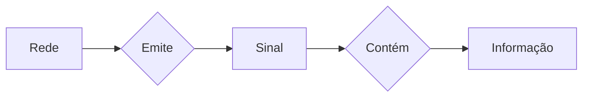

# Redes

#### Transmissão da informação

#### Protocolo

*`Uma série de regras e procedimentos definidos para que uma comunicação possa acontecer de forma eficaz.`*

## Os quatro elementos

### 1 - Emissor / Receptor

#### 1.1 - DTE ( _Data Terminal Equipment_ )

Responsável por **gerar** a informação que será transmitida. Em resumo, são os dispositivos que geram, recebem ou armazenam dados, como computadores, terminais e impressoras e interagem diretamente com o usuário ou com o sistema que utiliza os dados.

#### 1.2 - DCE ( _Data Communication Equipment_ )

Responsável pela **codificação** da informação a ser transmitida no formato mais adequado para transmissão. Fornecem a interface entre o DTE e a rede de comunicação sendo então os dispositivos que facilitam a comunicação entre DTEs, como modems, roteadores e conversores de protocolo. 

### 2 -  Meio fisico

É o material ou substrato responsável pelo suporte ao encaminhamento dos sinais. Estes, por sua vez, encontram-se, tal como já vimos, codificados com a informação a ser transmitida. 
O meio físico mais adequado para a transmissão dos sinais é determinado por:
* Características do ambiente por onde o sinal será encaminhado;
* Custo associado à sua disponibilidade;
* Velocidade;
* Taxa de transferência necessárias;
* Distância entre emissor e receptor.
#### 2.1 - Propriedades
#### 2.1.1 - Velocidade de propagação

É medida em metros por segundo (_m/s_), e representa a velocidade com que o sinal que carrega as informações se propaga pelo meio físico em questão.
A velocidade de propagação é definida como a razão entre o espaço percorrido por um determinado sinal em um meio físico $\Delta S$, e o tempo decorrido para percorrê-lo $\Delta T$.

$$
	Vp = \frac{\Delta S}{\Delta T}
$$

#### 2.1.2 - Taxa de sinalização ( _baud rate_ )

Podendo ser medida em bouds ou Hz, a taxa de sinalização é a **frequência máxima** com que um sinal em um meio físico pode mudar de estado por segundo, representando então um limite para que a informação seja transmitida sem perdas significativas. Essas "_alterações de estado_," também chadas de "_eventos_", podem ser:

*   **Variações de voltagem:** Em um cabo elétrico, o estado pode mudar de uma voltagem alta para uma baixa.
*   **Variações de luz:** Em uma fibra óptica, o estado pode ser a presença ou ausência de luz.
*  **Variações de fase:** Em sinais sem fio, a fase da onda pode mudar.

Definindo então a velocidade com que os "_eventos_" do sinal ocorrem, ela é uma medida fundamental que está diretamente relacionada à capacidade de um meio físico de transmitir informações sem que o sinal se degrade, sendo um fator limitante na velocidade de transmissão de dados.

Fazendo uma analogia, a taxa de sinalização poderia representar o limite que um cano pode transportar um liquido sem que ele estoure, fazendo os relacionamentos ficaria:

- Vazão do liquido ----> Taxa de sinalização
- Cano -----------------> Meio físico (cabos por exemplo)
- Liquido---------------> Informação
- Pressão do liquido --> Evento
- Estourar do cano ----> Degradação da informação

#### 2.1.3 - Taxa de transferência ( _bit rate_ )

É dada pela quantidade de informação (_bit_) que é codificado, enviado e decodificado - ou seja, que é transferida - em segundo (_bps_). Ela não está relacionada apenas ao meio físico, mas também à taxa de sinalização e à tecnologia de codificação utilizada.
A taxa de transferência e a taxa de sinalização estão inter-relacionadas, então, pela tecnologia de codificação utilizada.

$$
    T_{tr} = T_{s} \cdot \log{_{2}(n)}
$$

- $T_{tr}$ = Taxa de transferendia (bps)
- $T_{s}$ = Taxa de sinalização (Hz)
- $n$ = Representa a quantidade de **estados diferentes** que cada uma das alterações de estado da $T_{s}$ pode assumir. Em outras palavras, é o "número de opções" de estados que o sinal pode ter a cada evento. Quanto maior $n$ for, maior a BER (*Bit Error Rate*).

$$
	BER = \frac{Bits_{recebidos-com-erro}}{Bits_{transmitidos}} 
$$

#### 2.2 - Classificação

#### LAN

São definidas como redes de comunicação de alcance limitado, normalmente utilizando meios físicos de propriedade privada da organização atendida pela rede. Como os meios físicos são de uso dedicado, normalmente estes são dimensionados para oferecer a melhor performance possível dentro das limitações de distância da organização. Por isto as LANs normalmente oferecem taxas de sinalização e velocidades de propagação bastante elevadas. Como é bem mais fácil evitar fontes de interferência e ruído dentro de distâncias limitadas, as taxas de erro típicas (BER) são reduzidas. Conseqüentemente, as taxas de transferência típicas são elevadas, atendendo a um conjunto bastante grande de aplicações.

#### WAN

Ao contrário das LANs, as WANs não possuem limites de distância. Normalmente são atendidas por meios físicos ofertados por concessionárias de serviços de telecomunicações, e por isto têm a capacidade total de seus meios físicos rateados entre os diversos usuários. As WANs normalmente possuem performance limitada, e taxas de erro elevadas. Isto limita as aplicações que podem ser utilizadas em ambientes baseados neste tipo de infra-estrutura de telecomunicação.

#### MAN

Possui um misto de características entre as LANs e as WANs. Normalmente espalhadas dentro dos limites de uma cidade (raio típico de até 70km), as MANs oferecem performance normalmente superior às WANs, e com isto permitem aplicações mais especializadas.

de quem é o cabo? seu? LAN; do outro? WAN
LAN - quando não há limites em problemas técnicos (performace, taxa de erro, atraso, etc)
WAN - area estendida pelo globo / grandes distâncias
MAN - Região metropolitana

#### Por Tanenbaum:

- LANs: Rede de área Local (até 2km)
- WANs: Rede de área estendida (de 2km até a estratosfera)
- MANs: Redes de Área Metropolitana

#### Por Marco Câmara:

- LAN: se você é dono do cabo
- WAN: se a operadora é dona do cabo
- MAN: rede bancada pelo governo

### 2.3 Tipos de meios físicos

## Tipo processamento

### Lote

**Método no qual grandes volumes de dados coletados são processados em partes ou lotes**. Essa abordagem é especialmente eficaz para trabalhos com uso intensivo de recursos, tarefas repetitivas e gerenciamento de conjuntos de dados extensos em que o processamento em tempo real não é necessário.
Neste tipo de processamento, cada informação a ser processada é arquivada temporariamente até a formação de um grupo (conhecido como lote ou batch), para posterior processamento.

### Online

Refere-se principalmente a ferramentas e software que executam tarefas de gerenciamento e monitoramento de redes pela internet, como a criação de diagramas de topologia, análise de tráfego e detecção de falhas, utilizando tecnologias baseadas na web para maior acessibilidade e colaboração em tempo real.
Indica o encaminhamento imediato das informações para o processamento, sem nenhum agrupamento anterior. Isto exige a conexão contínua entre o emissor e o receptor do sistema de telecomunicações.

### Tempo Real

O processamento de rede em tempo real  envolve a coleta e análise contínua e imediata de dados de rede para identificar problemas, monitorar a utilização e garantir a performance de serviços críticos como videoconferência, permitindo a tomada de decisões e ações corretivas instantâneas para manter a qualidade e a estabilidade da rede.
Na prática, o tempo de resposta deve ser suficientemente pequeno para garantir a influência no processo subseqüente. Sendo assim, a depender da aplicação, podemos ter diferentes tempos de resposta, sem perder a característica de processamento em tempo real.

- Precisa ser on-line

## Classificação das transmissões

### Quanto ao sentido do fluxo

Em um sistema de telecomunicações, as informações podem fluir em diversos sentidos, a depender da aplicação e da tecnologia empregada. Para caracterizar e identificar os sentidos dos fluxos de informação em um sistema de telecomunicações, utiliza-se as seguintes nomenclaturas:

#### __Simplex__

- Mensagem apenas de A -> B, um unico sentido

#### __Half-Duplex__

- Tempo e/ou sentido diferente
- Mensagem vai no sentido A <-> B
- Ex: Walkie Talkie

#### __Full-Duplex__

- Tempo e/ou sentido igual
- Mensagem vai so sentido A <-> B
- Ex: Ligação por telefone

### Quanto ao formato

Ao encaminhar as informações, pode-se escolher entre o envio serial ou paralelo dos dados. Em uma transmissão, os dados são codificados em conjuntos de bits, ou palavras (tipicamente iguais a um byte). 

Na **transmissão paralela**, são transmitidos todos os bits de uma palavra ao mesmo tempo, por meios físicos individuais. Apesar de rápida, a transmissão paralela tem problemas, como o custo mais elevado para distâncias mais elevadas, devido à necessidade de meios físicos mais complexos e caros, além da maior sensibilidade a interferências externas, também devido à exposição de um maior número de meios físicos.
Na **transmissão serial**, os bits são transmitidos de um a um, em série (daí o nome). Apesar de mais lenta, é largamente utilizada devido à sua padronização e baixo custo. Ainda falando da transmissão serial, esta pode ocorrer de duas formas:

#### __Síncrona__

O sincronismo não precisa ser reestabelecido tantas vezes. Os dados são enviados em um fluxo contínuo

Neste tipo de transmissão, os DCEs do emissor e do receptor se sincronizam para a transmissão de um conjunto de dados, normalmente bem maior do que os caracteres transmitidos na transmissão assíncrona. O processo de estabelecimento do sincronismo (durante o qual não ocorre transmissão de dados) ocorre apenas no início de cada bloco, o que implica em um desperdício da capacidade de transmissão do canal bem menor do que nas transmissões assíncronas. Esta maior eficácia de transmissão exige, tipicamente, a utilização de técnicas mais apuradas para detecção de erros.
Além disto, como a verificação dos erros só pode ser realizada ao final da transmissão de cada bloco, os DCEs do emissor e do receptor devem ser capazes de armazenar o conjunto de bytes a ser transmitido ou recebido em um buffer.

#### __Assíncrona__

O sincronismo precisa ser reestabelecido muitas vezes. Ex: envio de um byte por vez. Os dados são enviados em blocos separados, com intervalos entre eles, e cada bloco geralmente inclui bits de início e parada para indicar o começo e o fim.
Caracteriza-se pela necessidade de sincronização ao final da transmissão de cada palavra. Em função disto, são acrescentadas informações no início e final de byte, para identificação e sincronismo. O termo assíncrona, embora possa nos levar a acreditar que trata-se de uma transmissão sem sincronismo, na verdade deve ser interpretada como um sincronismo simplificado, e não muito preciso. O mesmo termo também é utilizado, em algumas situações, para identificar o fato do DCE do receptor nunca saber quando será recebido o próximo byte (ou caractere), já que a transmissão pode ser iniciada e interrompida a qualquer momento. Isto advém da transmissão ocorrer de forma dividida em pequenas unidades.

## Codificação de dados

### Modulação

Quando falamos em **modulação**, estamos falando de **pegar um sinal puro (uma senoide)** e **alterar alguma característica dela** (amplitude, frequência ou fase) para transportar informações.

#### Por que senoide?  

Porque a senoide é o **comportamento natural das ondas** (som, luz, rádio, etc). Ela é uma forma de onda básica que se repete infinitamente e é fácil de manipular matematicamente.

Exemplo:

-   Modulação em **amplitude (AM)** → altera a altura da onda.
-   Modulação em **frequência (FM)** → altera a quantidade de oscilações por segundo.
-   Modulação em **fase (PM)** → altera a posição da onda no tempo.

### Senoides

### 1. Amplitude

É a "altura" da onda → a distância entre o topo (pico) e o fundo (vale).

-   Maior amplitude = sinal mais forte (mais energia).
    
### 2. Frequência e Período

-   **Frequência (f)** = quantas vezes a onda se repete por segundo (Hz).
-   **Período (T)** = tempo que a onda leva para completar **1 ciclo**.
    -   Fórmula: $f = \frac{1}{T}$
-   **Comprimento de onda (λ)** = quanto a onda "anda" no espaço durante um ciclo.
    -   Fórmula: $\lambda = \frac{v}{f}$​ (velocidade / frequência).
        
### 3. Fase

É a **posição da onda em relação ao eixo x (tempo)**.

-   Imagina duas ondas iguais, mas uma começa "atrasada" → isso é diferença de fase.
-   Medida em radianos: $\pi$
	- 0º -> $\frac{\pi}{2}$ -> $\pi$ -> $\frac{3\pi}{2}$ -> $2\pi$ ou 0º
-   Representada no círculo trigonométrico.

### Banda-base

Na **banda-base**, o sinal não passa por uma senoide modulada, os **bits são enviados diretamente como pulsos de tensão** no meio físico.

#### NRZ (Non Return to Zero)

Assincrona, precisa ser enviado o clock
- unipolar ($0V$ -> $+V$) 
- bipolar ($-V$ -> $+V$) / 0 = -1 e 1 = +1

#### RZ (Return to Zero)

Assincrona, precisa ser enviado o clock
Cada bit tem um pico único

- unipolar ($0V$ -> $+V$) 
- bipolar ($-V$ -> $+V$) / 0 = -1 e 1 = +1

#### Manchester

Sincrona, não precisa enviar o clock
Nao mede o valor de cima e o de baixo, mede se subiu ou se desceu.
Analiza o meio do ciclo

$0$ -> sobe
$1$ -> desce

## Análise de Sinais

###  Jean-Baptiste Joseph Fourier (1768 - 1830)

Ele mostrou que **qualquer sinal, por mais estranho que pareça, pode ser representado como a soma de várias senoides** de diferentes frequências, amplitudes e fases.

#### Transformada de Fourier

$$
	f(t) = \frac{1}{\pi} \int_0^{\infty} (A(w) cos(w) + B(w)sen(w)) dw
$$

Isso é a **Transformada de Fourier** → pega um sinal no tempo e decompõe em suas frequências.

#### Exemplo clássico: onda quadrada

Uma onda quadrada não é "natural", mas Fourier mostrou que ela pode ser formada somando infinitas senoides:

$$
	f(t) = \frac{a}{2} + \sum_{n = 1}^{\infty} \frac{1}{n} sen(n x)
$$

-   A primeira senoide (n=1) é a **fundamental**.
-   As outras (n=3,5,7...) são as **harmônicas**.
-   Quanto mais harmônicas você soma, mais a onda fica parecida com um quadrado.

#### O que significa "infinitas senoides"?

Significa que **qualquer forma de onda (mesmo quadrada, triangular ou um som de música)** pode ser decomposta em uma soma de senoides de frequências diferentes.

-   Uma senoide pura = som "limpo".
-   Um sinal quadrado = infinita soma de senoides harmônicas.

## Unidades de medida

A potência de um sinal é uma característica fundamental para a análise de um sistema de telecomunicações, já que o sinal que chega ao receptor deve ter uma potência mínima para que possa ser interpretado.
Medem as alterações ocorridas na potência de um sinal ao atravessar um sub-sistema qualquer, seja um meio físico ou equipamento de comunicação.

### Decibel ($dB$)

O Decibel é a relação logarítmica entre as potências de saída e de entrada e como estamos dividindo uma potência pela outra, trata-se de uma unidade adimensional (sem dimensão).

> Uma unidade adimensional  não possui unidades de medida e pode ser entendida como um número puro ou um valor que não está ligado a uma dimensão física como massa, tempo ou comprimento. Elas geralmente surgem da divisão de duas grandezas de mesma unidade, resultando na anulação das unidades e, consequentemente, um valor sem dimensão.

No entanto, devido aos típicos valores fracionários desta unidade, na prática é mais utilizada a sub-unidade decibel (dB), que igual a valor em Bells (resultado do logaritmo decimal da divisão $\frac{P_e}{P_s}$ ) multiplicado por 10. E assim obtemos a formula:

$$
	Ganho/Atenuacao = 10 \log{ \frac{ P_e }{ P_s }} 
$$

> Lembre-se, a potência é medida em Watts $W$

E se for:
- $ > 1 $ -> Amplificação
- $ = 1 $ -> Resposta plana (Quase nunca)
- $ > 1 $ -> Atenuação (Na maioria das vezes nas redes)

### Relação de potências ($dBm$)

Para simplificar os cálculos de relação de potência, usando as propriedades dos logaritmos, é adotado pelos profissionais de telecomunicações uma nova unidade de potência absoluta, o $dBm$. Os valores de potência em $dBm$ são obtidos através da comparação das potências expressas em Watts com uma potência de referência de $1mW$.

$$
	P[dBm] = 10 \log { \frac{ P[W] }{ 1mW } }
$$

Para obter ganho ou atenuação em $dB$ a uma potência expressa em $dBm$, basta somar os dois valores no caso de ganhos, ou subtrair em caso de atenuação.

**Perda/Ganho (em dB)** = $P_{saída}$​[dBm] − $P_{entrada​}$[dBm]

Observações: 
-	Não se deve somar comparações, $dBm$ para obter $dBm$. Para soma-los de fato, você precisa primeiro converter os valores de $dBm$ de volta para a escala linear de potência em miliwatts (mW), somá-los, e depois converter o resultado de volta para dBm.
- $dBm$ pode ser negativo sem problema, mesma lógica de aceleração negativa (Freio), significa que a potência medida é **menor que 1 mW**
- $W$ nunca deve ser negativo, mesma lógica de distancia/tempo negativo (-50m? -10s?)

## Definição de rede

 - Computadores autônomos: Só se conecta a rede o dispositivo que tem capacidade própria de processamento;
- Interligação: Ligação entre os dispositivos que permite a troca de informação entre eles.

### Estrutura das redes

Para cada um dos dispositivos interligados ao ambiente de rede, vamos dar o nome de host (hospedeiro). O ambiente de comunicação envolvido na interligação dos hosts será chamado de sub-rede e para que seja mais simples a análise de sub-redes mais complexas, temos mais dois elementos básicos: os circuitos ou canais de comunicação e os elementos comutadores. Chamaremos estes elementos comutadores de IMP (_Interface Message Processors_) e eles são pontos onde os hosts se conectam a sub-rede.

### Tipos de subredes

#### Difusão (Broadcasting)

Neste tipo de sub-rede, existe apenas um canal de comunicação, que é compartilhado por todas as estações. Desta forma, um pacote enviado por uma estação é recebido por todas as outras e ao receber um pacote, a estação deve ser capaz de analisar o endereço de destino para verificar se o pacote pertence a ela, fazendo com que o endereçamento seja um ponto essencial para um funcionamento de uma sub-rede por difusão. São muito comuns em LANs

- Vantagens:
	- Os dados são enviados em toda a area do dispositivo e todos os dispositivos podem ver;
	- Otimos para mandar mensagens.
- Desvantagens
	- Tempestade de broadcast: Quando há muitas mensagens no meio, muitas mensagens sendo transmitidas ao mesmo tempo na area

#### Ponto a ponto

Uma sub-rede ponto a ponto é uma conexão de rede a mais simples possível, ligando diretamente apenas dois dispositivos, como dois roteadores ou computadores. Por conectar somente dois pontos, ela permite uma comunicação extremamente direta e eficiente, sem a necessidade de intermediários. Este é o tipo de projeto normalmente adotado nas redes de longa distância (WAN).

### Topologias fisicas
Como são as interligações entre os IMPs (dispositivos) há sub-rede e descrevem o modo como os dispositivos estão interligados, bem como é feita a troca de informação entre eles. Esta pode garantir não só a performance do ambiente, como também a segurança e os custos envolvidos na implementação do projeto. 

#### Estrela

Considera a interligação de todos os pontos a um equipamento central, que pode ser composto por um dos hosts ou por um equipamento especial, conhecido como concentrador (ou HUB). O aumento do número de dispositivos na topologia em estrela é normalmente ilimitado, o que torna fácil a expansão da rede.

Em alguns casos, adota-se uma topologia derivada, chamada de topologia em árvore ou estrelas hierárquicas. Nesta, todas ou algumas extremidades da estrela se transformam no centro de novas estrelas secundárias. Neste caso, temos 3 níveis: o ponto central, os pontos secundários, e os hosts. Sendo muito comuns em LANs geralmente são de 2 níveis, mas aceita 3 também mesmo não sendo recomendado na maioria dos casos.

#### Barramento

O barramento compartilha um único meio físico para todos os hosts conectados. Esta característica implica na existência de um protocolo que determina a utilização do meio de transmissão por todos os dispositivos existentes na rede e cada estação, ao transmitir, se torna "proprietária" do meio físico único, impedindo que as demais estações o utilizem, a não ser que seja para a escuta dos pacotes enviados. Para que isto funcione, é necessário um mecanismo de arbitragem para resolver eventuais conflitos quando duas ou mais máquinas desejam transmitir simultaneamente, sendo o mesmo, também conhecido como alocação do canal, pode ser centralizado ou distribuído (mais comum).

- Primeira topologia usada nas redes
- Os dispositivos eram ligados em paralelo por cabo coaxial
- Desvantagem
	- É dependente do meio físico.
- Vantagens
	- É um broadcast natural;
	- Precisa de apenas 1 cabo.

#### Anel

Consiste em ligações ponto a ponto entre pares de dispositivos que, no seu conjunto, formam um ciclo fechado. A informação é transmitida através do anel em unidades de dados que são enviadas rotativamente segundo uma direção predefinida. Os mesmos contêm a informação sobre a origem da mensagem e o respectivo destinatário e ao receber a mensagem, o dispositivo receptor analisa a informação do destinatário e passa a mesma ao dispositivo seguinte mas o receptor seja o destinatário, ele recolhe uma cópia da mensagem para interpretação.

- ANSI -> FDDI (Fiber Distributed Data Interface) duplo cabo
- IBM -> Token-Ring
- Desvantagens
	- Protocolo complexo
- Vantagens
	-	Ambiente extremamente difíceis de parar

#### Mista

- Junção das das anteriores
-----------------

## Modelos em camadas

Conjunto de protocolos, procedimentos, equipamentos e componentes com caracteristicas similares que são agrupados em camadas especificas que prestam serviços entre elas.

- Superior solicita inferior

- sistema aberto: pode conecta com componentes de outros fabricantes/fornecedores; Seguem um conjunto de normas;
	- Vantagem: Mais barato
	- Desvantagens: 
- sistema fechado: se conecta apenas com os componentes do mesmo fabricante.
	- Vantagem: Confiailidade
	- Desvantagens: Mais caro, baixa flexibilidade 

#### Caracteristicas

1. No emissor, a informação cresce a medida que desce as camadas, ao contrario do que ocorre no receptor que diminui a medida que sobe;
2. As funções devem ser inequivocas / Cada camada deve fazer apenas o que foi desiguinada a fazer;
3. 
4. Se as camadas adjacentes concordarem com mudanças, você pode mudar também;

### Modelo OSI (Open Sistem Interconect)

 **DECORE**

- Possui 7 camadas onde a 1 é a mais baixa (Physical) e a 7 é a mais alta (Application)
- As camadas são:
	1. Physical - Fisica
	2. Data Link - Enlace/Ligação
	3. Network - Rede
	4. Transport - Transporte
	5. Session - Sessão 
	6. Presentation - Apresentação 
	7. Application - Aplicação 
	
	Para Dormir Nesse Treinamento Será Preciso Apresentação

#### Pq 7?

- Evitar equivocos de funções
- Compatibilidade com os padrões do mercado
	
#### Questões de projeto
1. Estabelecimento de Conexões
	-	Preparação prévia antes da troca de informações;
2. Encerramento de Conexões
	- ...
3. Endereçamento
	- Pode ser de 3 tipos:
		- Unicast: Um destinatário específico;
		- Multicast: Aponta para um grupo de destinatários;
		- Broadcast: Envia para todos em uma região.
	- Cada formato, exeto o broadcast, exige um endereçamento específico
4. Estabelecimento de Canais Lógicos
	-  Cada canal possui a sua própria tratativa
5. Controle de Erros
	- Desprezo: Quando o erro é extremamente dificil de ocorrer, não há tanta nescessidade de trata-lo;
	- Identificação e contagem: O desenvolvedor decide se irá trata-lo a depender da sua ocorrência;
	- Re-transmissão: Ocorreu um erro, envia novamente; Esconde os erros; Deixa a rede lenta; erro de Timeout;
	- Correção: Quando o reenvio é inviavel; Só é possivel corrigir o erro quando o mesmo é redundante;
6. Controle de Tamanho
	- Determinados canais de comunicação estabelecem tamanhos máximos e mínimos em seus protocolos, o que nem sempre é adequado ao tráfego das informações em seu formato bruto; Segmentação / agregação;
7. Controle de Fluxo
	- Muitas vezes a performance do transmissor não corresponde à capacidade do receptor de interpretar os dados recebidos; Controle tando de volume quanto de complexidade;
8. Ordenação
	- Organização dos dados que chegam
9. Multiplexação / Demultiplexação
10. Escolha da rota
	- Escolher uma rota que corresponda a demanda;

#### Camadas
1. Fisica: Determina as interfaces mecanicas, eletrica e tempos; Unidade de dados: $BIT$;
2. Enlace: Trata os erros; É muito rapida por ser uma camada baixa;

[Protocolo distancia de hamming](https://www.google.com/search?q=distancia+de+hamming&rlz=1C1VDKB_enBR1145BR1145&oq=distancia+de+hamming&gs_lcrp=EgZjaHJvbWUyBggAEEUYOTIHCAEQABiABDIHCAIQABiABDIICAMQABgWGB4yCAgEEAAYFhgeMggIBRAAGBYYHjIICAYQABgWGB4yCAgHEAAYFhgeMggICBAAGBYYHjIICAkQABgWGB7SAQcxOTFqMGo3qAIAsAIA&sourceid=chrome&ie=UTF-8&safe=active&ssui=on)

